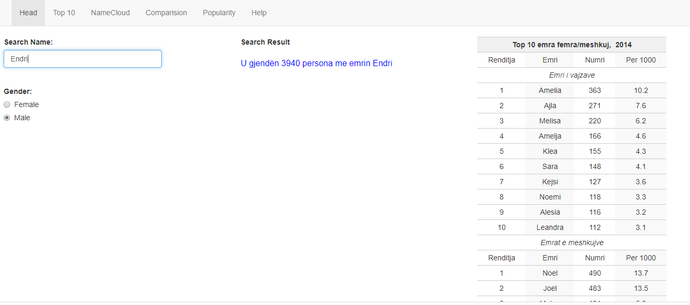
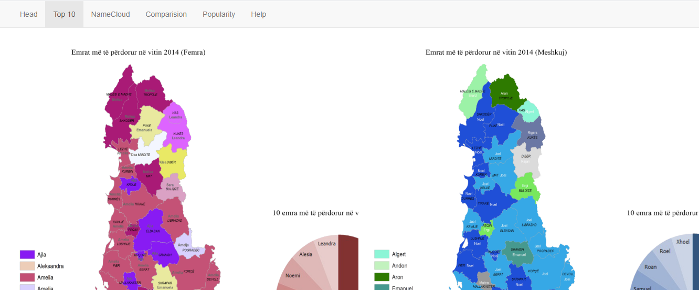
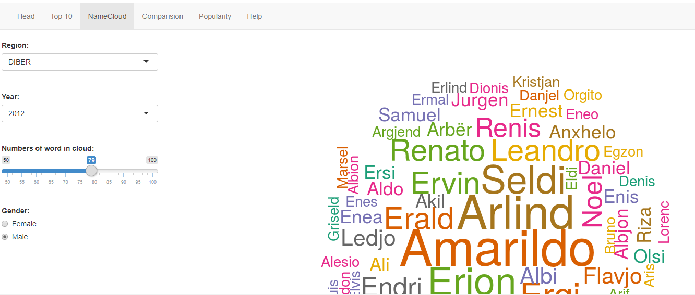
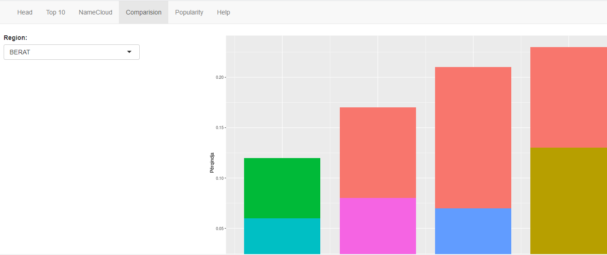
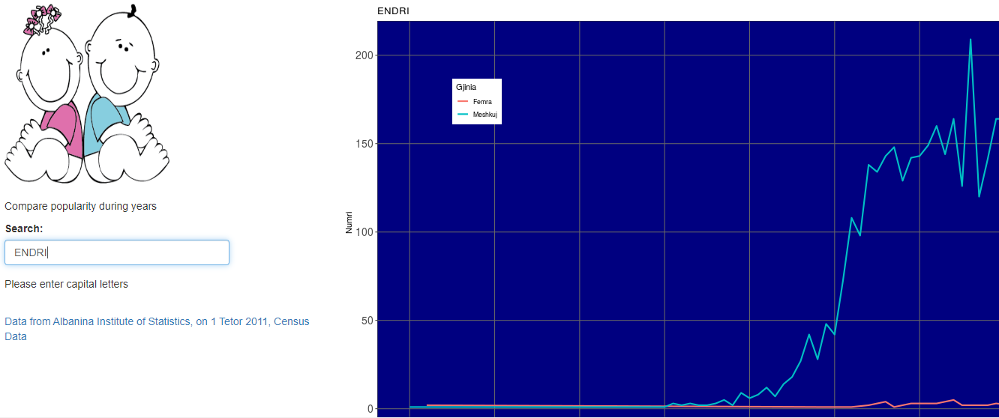

## Project

<h1> Albanian Database of Names </h1>

--- .class #id 

## Links

<h1> Github </h1>

https://github.com/endri81/albaniannames.git

<h1> ShinyApps </h1>

https://endriraco.shinyapps.io/albaniannames/

--- .class #id 

## My project

  - My project is called **Albanian Database of Names**.

  - It is an interactive presentation of Albanian names popular through years

--- .class #id 

## Tabset HEAD

--- .class #id 

## Tabset Top 10

--- .class #id 

## Tabset NameCloud

--- .class #id 

## Tabset Compariison

## Tabset Popularity

--- .class #id 

